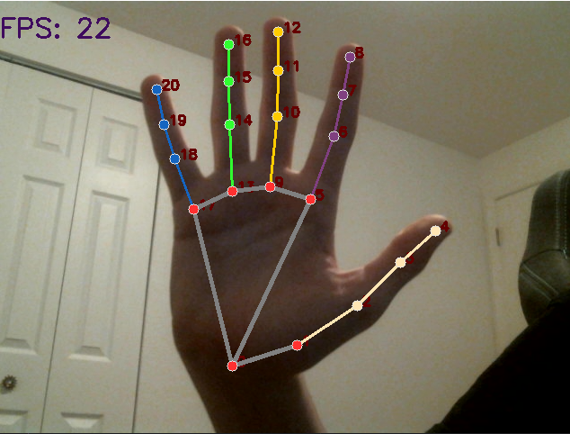

# Hand Tracker

This is a python script using OpenCV and Google's MediaPipe to track hand signs.

## Installation

Use the package manager [pip](https://pip.pypa.io/en/stable/) to install OpenCV and MediaPipe.

```bash
pip install -r requirements.txt
```

## Usage
To add a new gesture you can use individual hand ids. These are labeled per landmark on a hand from 0-20. They should be saved in an array called "cordarr". .

There is also a function called "Distance" that compares 2 landmark ids and finds a distance between them.
```python
distance(5,8) #compares distance from landmark 5 to landmark 8
```

## Contributing
Pull requests are welcome. For major changes, please open an issue first to discuss what you would like to change.

Please make sure to update tests as appropriate.

## License
[The Unlicense](https://choosealicense.com/licenses/unlicense/)
